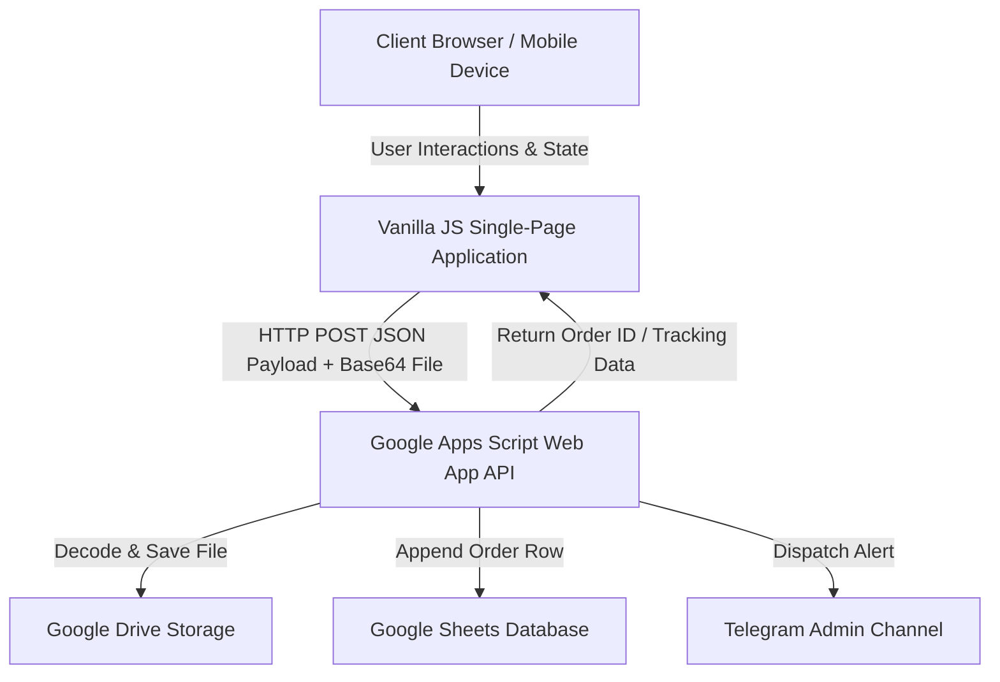
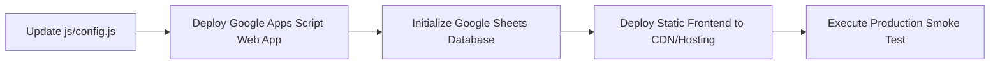

# TEKNOVISTA.KIT

Official order placement and tracking web portal built for Universitas Airlangga 2026 student assignment kits.

TEKNOVISTA.KIT is a production-grade single-page application that enables new students to order official university assignment kits (`Buku Panduan`, `ID Card & Lanyard`, `Lembar Hymne`, and `Janji Ksatria`). It handles the entire checkout journey through a stateful multi-step wizard, client-side payment proof processing, and real-time order tracking without relying on third-party frontend frameworks or build steps.

The platform operates on a vanilla web stack integrated directly with Google Cloud services via Google Apps Script. It serves as a serverless, zero-maintenance order portal where submissions are automatically recorded in Google Sheets, payment verification files are compressed and uploaded to Google Drive, and instant notifications are dispatched to administrative channels.

---

## Overview

The purpose of TEKNOVISTA.KIT is to streamline the ordering, payment verification, and fulfillment tracking processes for thousands of incoming university students. Traditional campus order workflows rely on fragmented spreadsheets, manual messaging, and unstructured forms, which lead to data inconsistency, missing payment proofs, and high administrative overhead.

By providing a structured, mobile-first ordering interface, the system ensures that student submissions conform to strict academic group validation rules before hitting the database. The platform is designed to handle high concurrency during registration peaks while maintaining a lightweight footprint that works across all mobile devices and network conditions.

---

## Key Features

- **Five-Step Checkout Wizard**: Guided, stateful progression across product selection, identity entry, payment verification, order review, and success confirmation.
- **Guest Checkout**: Direct ordering without requiring user registration, account creation, or password management.
- **Bundle and Individual Product Ordering**: Flexible selection supporting discounted bundle packages (`Amerta Kit Terlengkap`) or individual item selection.
- **Live Order Summary**: Real-time calculation of subtotal, quantities, and selected items anchored across all checkout steps.
- **Payment Proof Upload**: Drag-and-drop file upload supporting QRIS and bank transfer receipt images or PDF documents.
- **Client-Side Image Compression**: Automatic HTML5 Canvas resizing and JPEG compression that reduces large smartphone photos to under 800px width prior to network transmission.
- **Google Drive Integration**: Direct Base64 stream uploads to designated administrative Google Drive folders with automated file sanitization and renaming.
- **Google Sheets Database**: Structured tabular storage for order records, customer details, payment references, and administrative notes.
- **Google Apps Script Backend**: Serverless REST API layer processing POST payloads, handling multipart file conversions, and serving order queries.
- **Telegram Notification**: Automated administrative alerts dispatched upon new order submissions containing summary metrics and direct verification links.
- **Order Tracking**: Dedicated lookup interface allowing users to query current order status using their unique Order ID and verified WhatsApp number.
- **Timeline-Based Tracking Interface**: Visual milestone progression displaying verification, production, shipping, and completion phases.
- **Automatic Draft Persistence**: Continuous local storage state saving that recovers participant data and selections if the browser tab is accidentally closed.
- **Automatic Session Reset**: Clean lifecycle separation that clears draft storage and resets user variables immediately upon successful order completion.
- **Mobile Responsive Interface**: Fluid layout optimized for modern smartphones and tablets, featuring horizontal scrollable navigation and vertical pricing layouts.

---

## Technology Stack

| Layer | Technology |
|---|---|
| Frontend | HTML5 Semantic, Custom CSS3 (Vanilla), ES6+ Modular JavaScript |
| Backend | Google Apps Script (REST Web App `doPost` / `doGet`) |
| Database | Google Sheets |
| Storage | Google Drive (Folder API binding) |
| Notifications | Telegram Bot API |
| Hosting | Static Web Hosting (GitHub Pages, Cloudflare Pages, Vercel, or Local Server) |

---

## System Architecture

The application implements a decoupled architecture where a lightweight static frontend communicates with a serverless cloud backend over HTTPS. All business logic, input validation, and state persistence execute inside the client browser, while data persistence, file IO, and external messaging occur asynchronously within Google Workspace infrastructure.



---

## Project Structure

```text
TEKNOVISTA.KIT/
├── assets/                  # Static media, vector icons, SVG illustrations, and product images
├── css/                     # Vanilla CSS design tokens, layout grids, and mobile-first media queries
├── docs/                    # Detailed technical documentation architecture and maintenance guides
├── js/                      # Core application modules, state controllers, and utility libraries
│   ├── services/            # Promise-based networking layers for checkout submission and tracking
│   └── utils/               # Modals, toasts, form validation, currency formatting, and storage wrapper
├── index.html               # Main landing page and five-step checkout wizard interface
└── tracking.html            # Dedicated order verification and milestone progression portal
```

### Folder Responsibilities

- **`assets/`**: Contains visual design assets separated into `icons/`, `images/` (branding and QRIS placeholders), and `products/` (catalog item thumbnails).
- **`css/`**: Houses `style.css`, which defines HSL color variables, typography scales, responsive breakpoints, and UI component styling.
- **`docs/`**: Modular markdown documentation covering architectural specifications, backend integration contracts, and deployment runbooks.
- **`js/`**: Application business logic organized by responsibility. `app.js` serves as the primary DOM and wizard state controller; `config.js` and `constants.js` manage global configuration; and `products.js` maintains catalog definitions.
- **`js/services/`**: Encapsulates network communication. `api.js` handles checkout payloads and client-side canvas compression, while `trackingService.js` manages lookup requests.
- **`js/utils/`**: Reusable helper utilities providing form validation (`validator.js`), local storage synchronization (`storage.js`), modal dialogs (`modal.js`), toast alerts (`toast.js`), and string formatting (`formatter.js`).

---

## Getting Started

### Prerequisites

No build tools, Node.js packages, or external package managers are required to run the frontend locally. A modern web browser supporting ES6 modules and HTML5 Canvas is required.

### Local Execution

1. **Clone the repository**:
   ```bash
   git clone https://github.com/teknovista/teknovista.kit.git
   cd teknovista.kit
   ```

2. **Run with Live Server (Recommended)**:
   If using Visual Studio Code, install the `Live Server` extension, right-click on `index.html`, and select `Open with Live Server`. The application will launch at `http://127.0.0.1:5500`.

3. **Run with Python Local Server**:
   Alternatively, start a local HTTP server from your terminal inside the project root:
   ```bash
   python -m http.server 8000
   ```
   Navigate to `http://localhost:8000` in your web browser.

---

## Configuration

All environment variables, API endpoints, and static business rules are centralized within specific configuration files inside the `js/` directory to prevent hardcoded literals inside core logic:

- **`js/config.js` (`APP_CONFIG`)**: Defines the target `gasApiUrl` (Google Apps Script Web App endpoint), `googleDriveFolderId`, `googleSheetId`, administrative contact numbers, bank transfer account details, and order countdown deadlines.
- **`js/constants.js`**: Contains invariant system constants, including `STORAGE_KEY`, maximum allowed file sizes (`5 MB`), supported file extensions (`JPG/PNG/WEBP/PDF`), wizard step indices (`STEP_PRODUCT` through `STEP_SUCCESS`), and order status enum strings.
- **`js/products.js`**: Holds the authoritative catalog items (`productsList`) and bundle definitions (`bundlePackage`) rendered across Step 1 of the checkout wizard.

> [!NOTE]
> When deploying to a new environment or Google Workspace account, update `gasApiUrl` inside `js/config.js` with your deployed Google Apps Script URL. Do not commit sensitive service account credentials to this repository.

---

## Deployment

TEKNOVISTA.KIT operates as a static frontend coupled to a serverless backend. Deployment requires configuring both layers in sequence:



1. **Deploy Google Apps Script Backend**: Bind your backend script to the target Google Sheet and deploy it as a Web App with access set to `Anyone`.
2. **Configure Spreadsheet Headers**: Verify that the database sheet contains exact column alignments corresponding to the order payload schema.
3. **Update Client Configuration**: Insert the live Web App URL into `js/config.js` under `APP_CONFIG.gasApiUrl`.
4. **Publish Static Frontend**: Push the repository root to any static hosting service (`GitHub Pages`, `Cloudflare Pages`, or `Vercel`).

For detailed step-by-step instructions covering cloud permissions, CORS behavior, and folder configurations, refer to the [Deployment and Configuration Guide](docs/09-deployment-and-configuration-guide.md).

---

## Documentation

Exhaustive technical specifications, data schemas, API contracts, and design tokens are documented inside the `/docs` directory. To maintain clarity, deep architectural implementations are separated into modular topics:

| Document | Description |
|---|---|
| [Project Overview](docs/01-project-overview.md) | High-level executive summary, target users, and domain boundaries |
| [System Architecture](docs/02-system-architecture.md) | End-to-end system topology, data flow, and security model |
| [Frontend Architecture](docs/03-frontend-architecture.md) | Vanilla JavaScript single-page wizard and tracking controller mechanics |
| [State and Storage Lifecycle](docs/04-state-and-storage-lifecycle.md) | Dual-state model, local storage persistence, and checkout reset lifecycle |
| [Backend GAS Integration](docs/05-backend-gas-integration.md) | Google Apps Script (`doPost`) web app and Google Drive upload automation |
| [Spreadsheet and Data Schema](docs/06-spreadsheet-and-data-schema.md) | Google Sheets database layout, column mappings, and status enums |
| [Order and Tracking Workflows](docs/07-order-and-tracking-workflows.md) | Sequence diagrams and state machine progressions for orders and tracking |
| [Responsive and UI Design System](docs/08-responsive-and-ui-design-system.md) | CSS tokens, mobile layout refactoring rules, and accessibility standards |
| [Deployment and Configuration Guide](docs/09-deployment-and-configuration-guide.md) | Production release procedures across frontend and cloud layers |
| [Developer Contributing and Changelog](docs/10-developer-contributing-and-changelog.md) | Coding guidelines, PR rules, and chronological version history |

---

## Development Workflow

- **Coding Style**: Maintain clean ES6+ modular syntax with strict separation between DOM manipulation, business logic, and network requests. Avoid introducing build dependencies, transpilers, or CSS frameworks.
- **Pull Requests**: Every code change must pass local manual smoke testing across both desktop and mobile viewports before submission. Ensure that `appState` structure invariants remain intact.
- **Documentation Synchronization**: This project enforces a strict code-first documentation philosophy. Any modification to application state schemas, API payload structures, or configuration tokens must be accompanied by synchronous updates to the corresponding markdown file inside `/docs`.

---

## License

This project is currently not distributed under an open-source license. All rights are reserved by Universitas Airlangga AMERTA 2026 Committee and TEKNOVISTA.KIT Engineering Team.